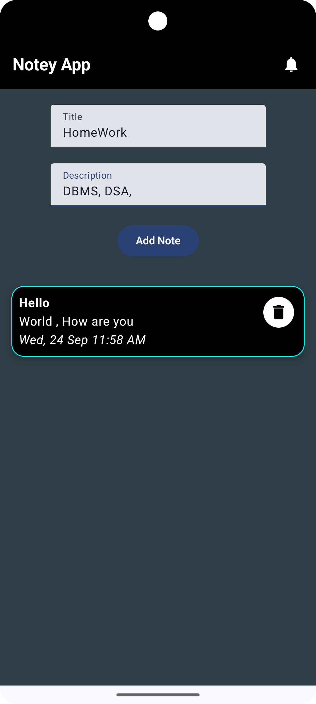
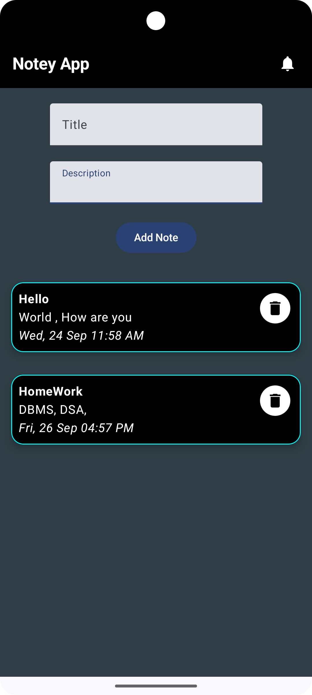

# Notey App

Notey App is a simple and user-friendly note-taking application designed to help you organize your thoughts, ideas, and daily tasks efficiently.

## Tech Stack
- **Language:** Kotlin
- **Framework:** Android Jetpack Compose
- **Database:** Room Database
- **Architecture:** MVVM (Model-View-ViewModel)
- **Dependency Injection:** Hilt
- **Tools:** Android Studio, Gradle

## Features
- Create, edit, and delete notes
- Organize notes with categories
- Simple and clean user interface
- Offline access to all notes

## Screenshots
Here are some screenshots of the app:

  
  

## Installation
Click NotesAPK folder and download the apk file.
